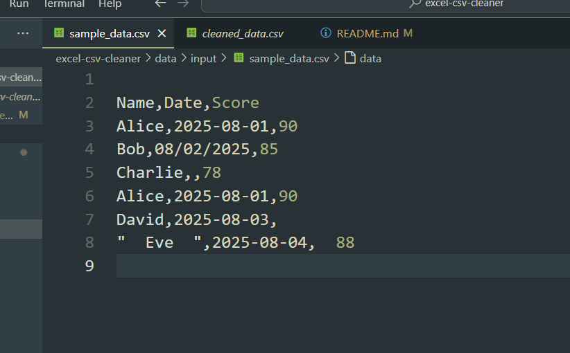
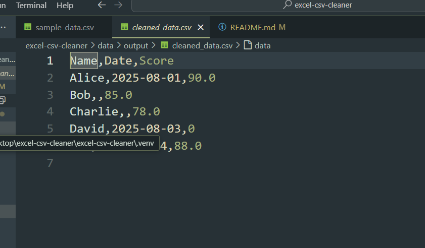

# Excel/CSV Cleaner – Automate Messy Data with Python

**Clean, standardize, and automate your CSV/Excel data effortlessly using Python and pandas. Perfect for small businesses, students, and freelancers!**

---

## Features

* Remove duplicate rows
* Fill missing values with custom defaults
* Standardize date columns to `YYYY-MM-DD`
* Convert numeric columns automatically
* Works with both CSV and Excel (`.xlsx`) files
* Simple command-line interface (CLI) for flexible usage

---

## Tech Stack

* Python 3.x
* pandas
* openpyxl

---

## Installation

1. Clone the repo:

```bash
git clone https://github.com/kalyan106-arch/excel-csv-cleaner.git
cd excel-csv-cleaner
```

2. (Optional) Create a virtual environment:

```bash
python -m venv .venv
# Windows
.venv\Scripts\activate
# macOS/Linux
source .venv/bin/activate
```

3. Install dependencies:

```bash
pip install -r requirements.txt
```

---

## Usage

### Basic CSV cleaning

```bash
python -m src.cleaner.cli --in data/input/sample_data.csv --out data/output/cleaned_data.csv --drop-duplicates
```

### Specify date & numeric columns + fill values

```bash
python -m src.cleaner.cli --in data/input/sample_data.csv --out data/output/cleaned_data.csv \
--date-columns Date --numeric-columns Score,Amount \
--fill Name=Unknown Score=0 Amount=0 --drop-duplicates --preview
```

### Excel input/output

```bash
python -m src.cleaner.cli --in data/input/messy_sales.xlsx --out data/output/cleaned_sales.xlsx \
--date-columns Date --numeric-columns Score,Amount --fill Score=0
```

> `--preview` shows the first few rows in the terminal for quick verification.

---

## Demo / Before & After

**Sample Input (`sample_data.csv`):**

| Name    | Date       | Score | Amount |
| ------- | ---------- | ----- | ------ |
| Alice   | 2025-08-01 | 90    | 100    |
| Bob     | 08/02/2025 | 85    |        |
| Charlie |            | 78    | 50     |
| Alice   | 2025-08-01 | 90    | 100    |

**Cleaned Output (`cleaned_data.csv`):**

| Name    | Date       | Score | Amount |
| ------- | ---------- | ----- | ------ |
| Alice   | 2025-08-01 | 90    | 100    |
| Bob     | 2025-08-02 | 85    | 0      |
| Charlie | N/A        | 78    | 50     |

### Demo Screenshots

**Input CSV:**


**Cleaned CSV:**



## Fiverr Gig Idea

* **Title:** I will clean and automate your Excel/CSV data using Python
* **Packages:**

  * \$15: Basic cleaning + dedupe
  * \$25: Clean + dedupe + date/numeric formatting
  * \$35: Custom rules + Excel support + short demo video

---

## License

MIT License © \[Kalyan Koushik]
